# 🎵 Melo: nghe nhạc kiểu Spotify trên iPhone

<div align="center">


**Tìm và nghe YouTube Music với giao diện kiểu Spotify. Tắt màn hình vẫn phát, tự chuyển bài, tải về nghe offline. Chạy hoàn toàn trên iPhone, không cần server.**

[](#cai-dat)
[](https://github.com/HoangDuc1003/spoti_music/releases/tag/ios-latest)
[](docs/WEB.md)

[](https://github.com/HoangDuc1003/spoti_music/actions/workflows/ios.yml)

</div>

---

## ✨ Tính năng

### Nghe nhạc 🎧

- **Tìm kiếm** có gợi ý khi gõ. Dán link bài, playlist hoặc album YouTube vào ô tìm kiếm để mở thẳng.
- **Phát nền thật:** tắt màn hình vẫn phát và tự chuyển bài. Điều khiển được từ màn hình khoá và tai nghe.
- **Hàng chờ kiểu Spotify:** *Phát tiếp*, *Thêm vào hàng chờ*, kéo thả để đổi thứ tự, trộn bài, lặp lại.
- **Radio tự động:** sắp hết hàng chờ thì app tự nối thêm bài tương tự.
- **Lời bài hát** chạy theo nhạc (LRCLIB). Có **hẹn giờ tắt**.

### Tải về & offline ⬇️

- **Tải song song tự điều chỉnh, tối đa 15 bài cùng lúc.** App tăng dần số bài tải cho tới khi băng thông hết tăng. YouTube chặn thì tự giảm và nghỉ một lúc. Trên 4G/5G tối đa 6 bài.
- **Khi mất mạng** app chỉ phát các bài đã tải.
- **Thích một bài là tự tải về** (bật trong Cài đặt).
- Nhạc lưu trong thư mục của app, **không đồng bộ lên iCloud**, và vẫn còn khi cài bản mới.

### Đồng bộ Spotify 🔄

- **Kết nối Spotify một lần**, có thể đăng nhập bằng Google trên trang của Spotify. Playlist của bạn và *Bài hát đã thích* hiện trong Thư viện với nhãn **Từ Spotify**.
- Melo tự tìm từng bài trên YouTube Music: so tên bài, nghệ sĩ và thời lượng, không ghép nhầm bản cover.
- **Tự đồng bộ khi mở app.** Playlist không đổi thì bỏ qua.
- Không có Premium: nhập từ file dữ liệu Spotify. Hướng dẫn: [docs/SPOTIFY.md](docs/SPOTIFY.md).

### Bản web 🌐

- **Không cần SideStore:** mở link bằng Safari → *Thêm vào MH chính*. Đưa lên Vercel một lần, mỗi lần đẩy code thì tự cập nhật.
- Nhạc từ **Jamendo** (kho nhạc Creative Commons) và **file nhạc của bạn** (MP3/M4A trong app Tệp, iCloud Drive; tự đọc tên bài và ảnh bìa trong file).
- **Mở app và nghe nhạc đã tải khi không có mạng.** Màn hình khoá hiện tên bài và nút chuyển bài.
- Không có YouTube Music: trình duyệt không gọi thẳng YouTube được, và Melo không dùng server. Hướng dẫn: [docs/WEB.md](docs/WEB.md).

### Thư viện 📚

- Bài hát đã thích, playlist tự tạo, lịch sử nghe, lịch sử tìm kiếm.
- **Vuốt từ mép trái** để quay lại trang trước, giống app iOS gốc.

---

## 📸 Ảnh màn hình

| **Trang chủ** | **Tìm kiếm** | **Album** |
|:---:|:---:|:---:|
| 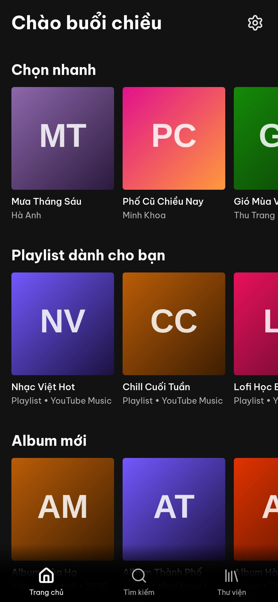 | 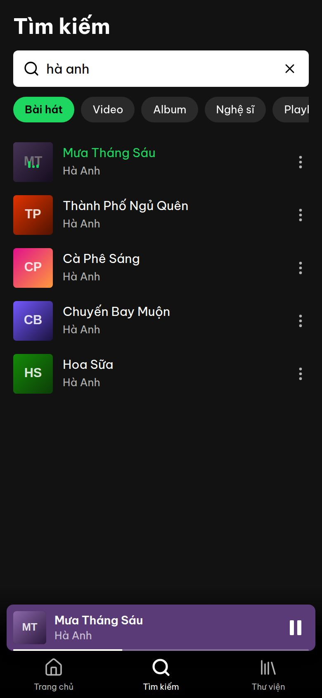 | 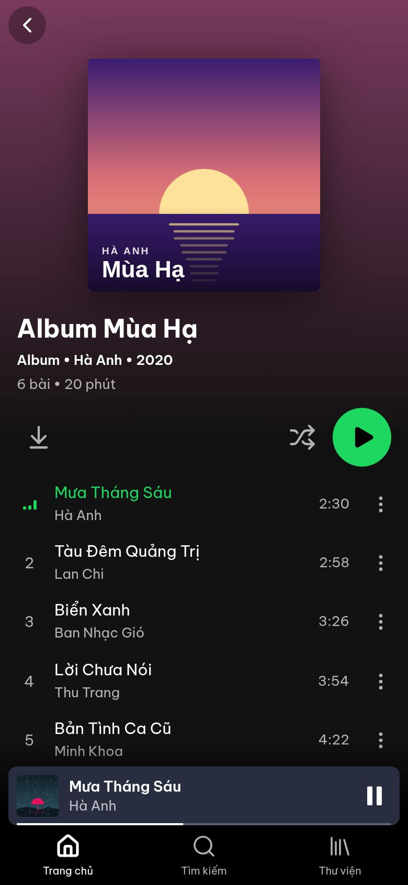 |
| *Chọn nhanh, playlist, album mới, nghệ sĩ.* | *Lọc theo bài hát, video, album, nghệ sĩ.* | *Tải cả album bằng 1 nút ⬇.* |

| **Trình phát** | **Lời bài hát** | **Hàng chờ** |
|:---:|:---:|:---:|
| 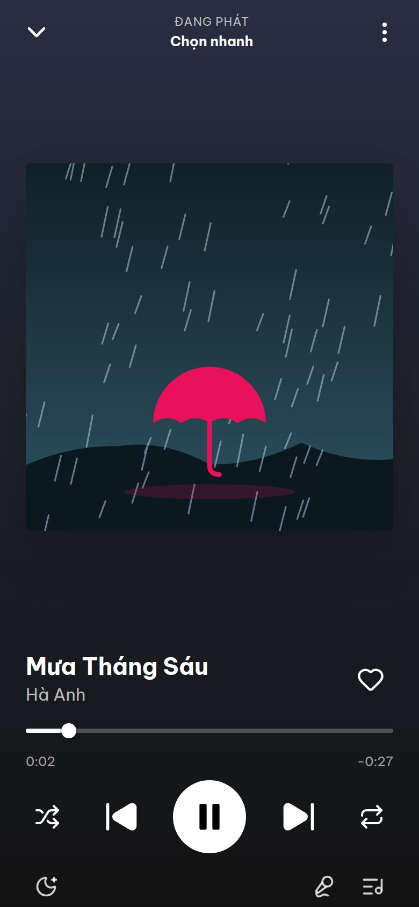 | 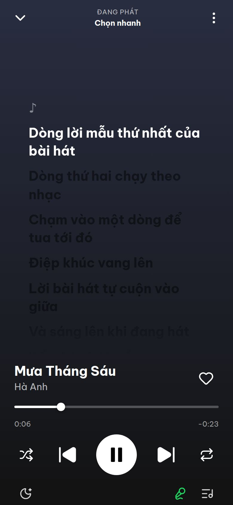 | 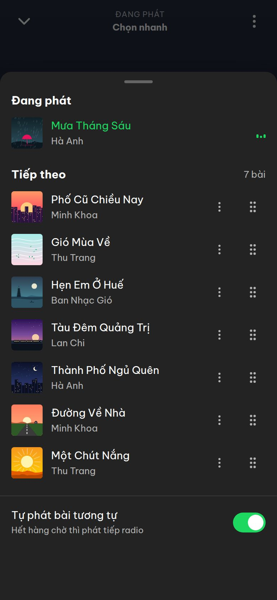 |
| *Màu nền theo ảnh bìa, vuốt xuống để đóng.* | *Lời chạy theo nhạc, chạm một dòng để tua.* | *Kéo thả đổi thứ tự, bật/tắt radio.* |

| **Thư viện** | **Đang tải** | **Cài đặt tải về** |
|:---:|:---:|:---:|
| 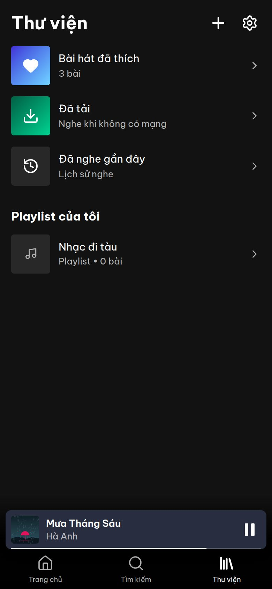 | 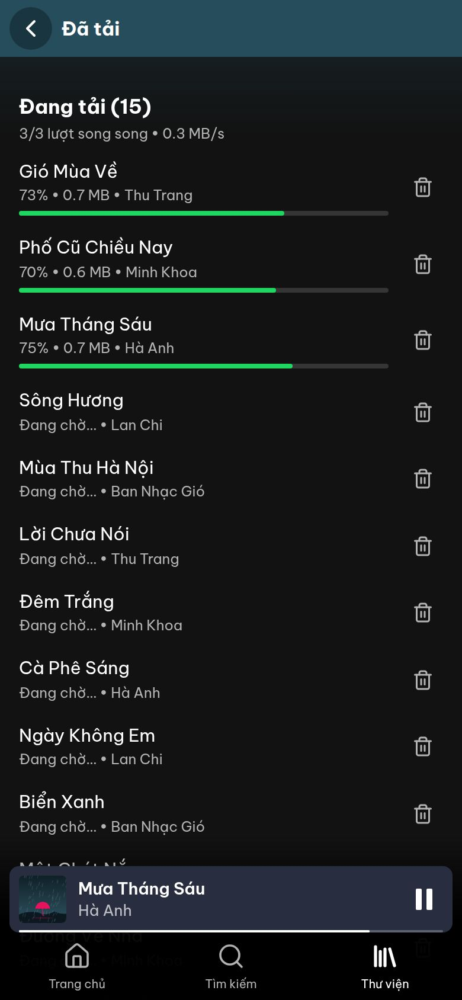 | 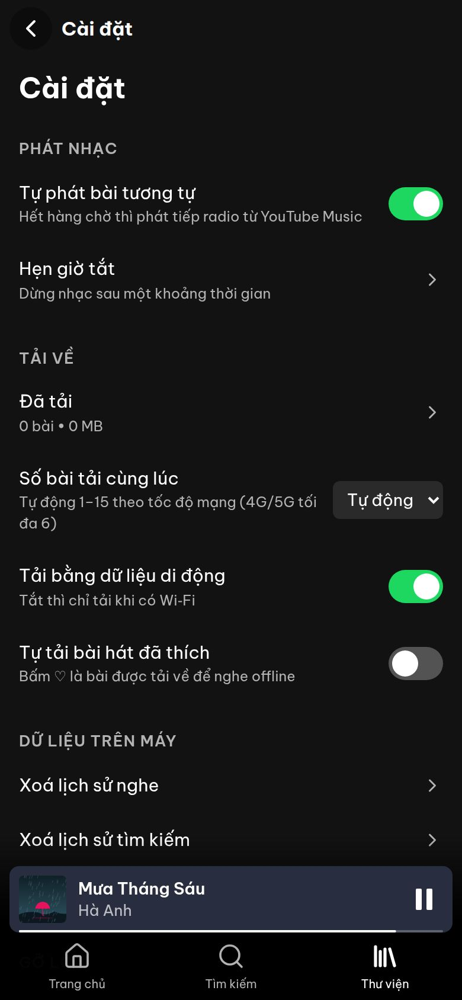 |
| *Bài đã thích, đã tải, playlist của bạn.* | *Tải nhiều bài cùng lúc, hiện tốc độ.* | *Tự động hoặc cố định 1–15 bài.* |

<sub>Ảnh chụp ở chế độ dữ liệu mẫu (`npm run dev:mock`), khổ iPhone 390×844. Ảnh bìa là tranh SVG tự vẽ theo tên bài (`src/youtube/mock/covers.ts`), không phải ảnh bìa thật; khi dùng thật, app hiện ảnh bìa từ YouTube Music.</sub>

---

<a id="cai-dat"></a>

## 📲 Cài lên iPhone

Apple chỉ cho cài app đã được ký. Melo không có trên App Store ([lý do](docs/APP_STORE.md)), nên có 2 cách:

| | 🆓 **Cách 1: SideStore** (khuyên dùng) | 💳 **Cách 2: Cài 1 chạm (Ad Hoc)** |
|---|---|---|
| Chi phí | **0 đ** | Apple Developer 99 USD/năm |
| Máy tính | Cần **1 lần**, khoảng 15 phút | Cần 1 lần (lấy UDID, tạo chứng chỉ) |
| Cập nhật | Bấm **UPDATE** trong SideStore | Mở trang cài đặt, bấm **Cài đặt Melo** |
| Gia hạn | 7 ngày, **tự gia hạn** trên iPhone | 1 năm |

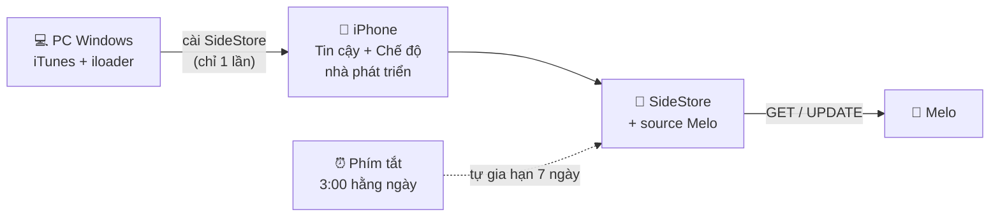

### 🆓 Cách 1: SideStore (miễn phí)

Chuẩn bị:
- PC **Windows 64-bit**;
- cáp USB;
- iPhone dùng **Wi‑Fi**, đã cài app **LocalDevVPN** từ App Store.

#### Bước 1: Trên máy tính (chỉ làm 1 lần)


- iTunes (bản của Apple): https://www.apple.com/itunes/download/win64
- iloader (file `.msi`): https://github.com/nab138/iloader/releases

#### Bước 2: Kích hoạt trên iPhone


#### Bước 3: Cài Melo bằng SideStore


Link source để dán vào SideStore (**Sources → +**):

```
https://github.com/HoangDuc1003/spoti_music/releases/download/ios-latest/source.json
```

#### Bước 4: Tự gia hạn 7 ngày (khuyên làm)


Xong! Từ giờ:
- có bản mới thì mở SideStore bấm **UPDATE**;
- nhạc đã tải và thư viện vẫn còn sau khi cập nhật.

<details>
<summary><b>🛠️ Gặp lỗi? Bấm để xem cách xử lý</b></summary>

| Hiện tượng | Cách xử lý |
|---|---|
| iloader không thấy iPhone | Cài iTunes **bản tải từ Apple**, không dùng bản Microsoft Store. Vẫn không được thì thử app **Apple Devices**. Cắm lại cáp, bấm **Tin cậy**. |
| Mở app báo "Nhà phát triển không được tin cậy" | Làm lại bước 2, mục **Tin cậy**. |
| SideStore báo lỗi khi cài, cập nhật hoặc gia hạn | Mở **LocalDevVPN**, bấm **Connect**, dùng Wi‑Fi rồi thử lại. |
| Melo không mở được sau 7 ngày | Mở SideStore, bấm **7 DAYS** cạnh Melo. Nhạc đã tải không mất. |
| Báo đã đủ số app | Apple ID miễn phí cho tối đa **3 app** tự cài, tính cả SideStore. Gỡ bớt một app. |
| Melo lỗi khi đang dùng | Trong Melo: **Cài đặt → Nhật ký lỗi → Copy**, rồi gửi cho người sửa app. Nhật ký đã tự ẩn IP, link và token. |

</details>

### 💳 Cách 2: Cài 1 chạm, không cần app thứ ba (Ad Hoc)

<table>
<tr>
<td width="270"></td>
<td>

Sau khi thiết lập một lần, mỗi lần cài hay cập nhật chỉ cần:

1. Mở **https://hoangduc1003.github.io/spoti_music/** bằng **Safari**.
2. Bấm **Cài đặt Melo**, rồi bấm **Cài đặt**.
3. Ra màn hình chính chờ app tải xong.

Không cần SideStore, không cần VPN, không phải gia hạn 7 ngày. Hồ sơ dùng được 1 năm.

**Thiết lập một lần:**
- tài khoản **Apple Developer** (99 USD/năm);
- đăng ký UDID của iPhone;
- tạo chứng chỉ và hồ sơ Ad Hoc;
- dán vào **3 GitHub Secrets**.

CI sẽ tự ký và đăng trang cài đặt. Hướng dẫn từng lệnh (làm được trên Windows): [docs/CAI_DAT.md](docs/CAI_DAT.md#cách-2-cài-1-chạm-ad-hoc-không-cần-mac).

</td>
</tr>
</table>

---

## ⚙️ Cách hoạt động

iOS tạm dừng JavaScript khi app chạy nền. Vì vậy **hàng chờ và việc phát nhạc nằm trong plugin Swift** (AVPlayer); phần JavaScript chỉ lo những việc cần mạng.

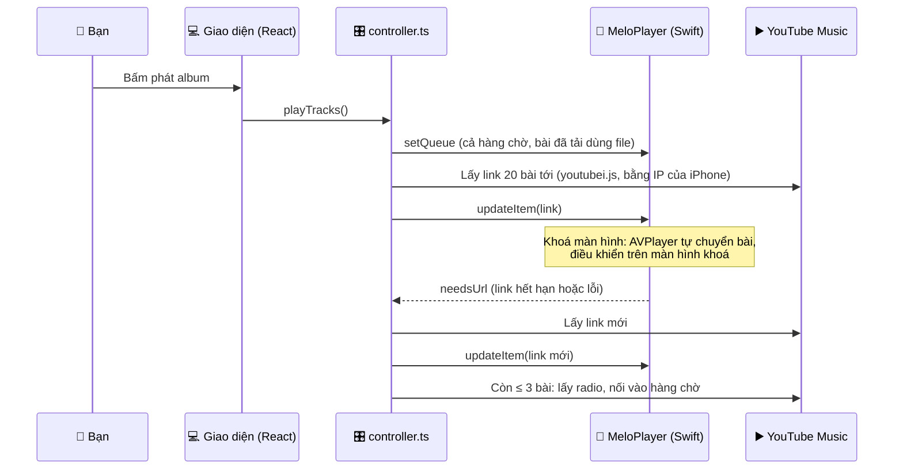

---

## 📂 Cấu trúc dự án

```
spoti_music/
├── src/                        # Giao diện + logic (React, TypeScript)
│   ├── pages/                  # Trang chủ, Tìm kiếm, Thư viện, Album, Nghệ sĩ, Đã tải, Cài đặt
│   ├── components/             # Trình phát mini/toàn màn hình, hàng chờ, lời bài hát, menu bài
│   ├── player/                 # Bộ điều khiển: hàng chờ, lấy link trước, radio, lưu/khôi phục
│   ├── downloads/              # Tải về: hàng đợi, tải song song tự điều chỉnh, lưu file
│   ├── sync/                   # Đồng bộ Spotify: đăng nhập PKCE, Web API, ghép bài sang YouTube Music
│   ├── youtube/                # youtubei.js, BotGuard, chọn client, dữ liệu mẫu (mock/)
│   ├── lib/                    # IndexedDB (Dexie), thư viện, lời bài hát, nhật ký lỗi
│   └── ui/                     # Điều hướng theo tab, lớp phủ, thông báo
├── plugins/player/             # Plugin Swift "MeloPlayer": AVPlayer, hàng chờ native, màn hình khoá
│   └── ios/Tests/              # XCTest cho hàng chờ native
├── ios/App/                    # Dự án Xcode (Capacitor), PrivacyInfo.xcprivacy
├── scripts/                    # Ký Ad Hoc, tạo source SideStore, kiểm tra giao diện, chụp ảnh README
├── docs/                       # Kế hoạch, hướng dẫn cài, App Store, chính sách quyền riêng tư, ảnh
└── .github/workflows/ios.yml   # CI: quét bí mật → test → build IPA → Release → trang cài đặt
```

---

## 🛠️ Công nghệ

| Phần | Công nghệ |
|---|---|
| **Giao diện** | React 19, TypeScript, Vite, Tailwind CSS 4, Zustand, TanStack Query |
| **App iPhone** | Capacitor 8, plugin Swift tự viết (AVPlayer, MediaPlayer, AVAudioSession) |
| **Nguồn nhạc** | youtubei.js (InnerTube), BotGuard / PO token (bgutils-js) |
| **Đồng bộ Spotify** | Spotify Web API, OAuth PKCE (không client secret), token trong Keychain, ghép bài sang YouTube Music |
| **Lưu trên máy** | IndexedDB (Dexie), file nhạc trong `Library/NoCloud`, File Transfer |
| **Lời bài hát** | LRCLIB, dự phòng bằng lời trên YouTube |
| **Kiểm thử** | Vitest (85 test), XCTest (15 test), Playwright (9 luồng giao diện) |
| **CI/CD** | GitHub Actions trên macOS: gitleaks, npm audit, build IPA, giới hạn dung lượng JS, Release, Pages |
| **Phát hành** | GitHub Releases + source SideStore/AltStore, trang cài Ad Hoc trên GitHub Pages |

---

## 🚀 Chạy trên máy tính (cho người phát triển)

```bash
git clone https://github.com/HoangDuc1003/spoti_music.git
cd spoti_music
npm install

npm run dev:mock   # dữ liệu mẫu, không cần YouTube: http://localhost:5173
npm run dev        # dữ liệu thật qua proxy của Vite
npm test           # vitest
npm run build      # kiểm tra kiểu + build
cd plugins/player && swift test   # test hàng chờ native (macOS/Linux)
```

- Không có Mac vẫn build được: mỗi lần push, GitHub Actions build `Melo.ipa` và đăng lên [Releases](https://github.com/HoangDuc1003/spoti_music/releases/tag/ios-latest).
- Muốn mở bản dev từ iPhone cùng Wi‑Fi: `MELO_LAN=1 npm run dev`. Lưu ý lệnh này mở cả proxy dev ra mạng LAN.
- Chụp lại ảnh cho README: `scripts/readme-shots.mjs` và `scripts/install-illustrations.mjs`.

---

## 🔒 Quyền riêng tư & bảo mật

- **Không server, không thu thập dữ liệu, không quảng cáo, không theo dõi.** Thư viện, lịch sử và nhạc đã tải chỉ nằm trên iPhone.
- App có Content-Security-Policy. Chỉ phát link `https` hoặc file trong máy.
- Nhật ký lỗi tự ẩn IP, link nhạc và token.
- Repo public nên CI quét bí mật (gitleaks) trên toàn bộ lịch sử git. Chứng chỉ ký chỉ nằm trong GitHub Secrets.
- Chi tiết: [chính sách quyền riêng tư](docs/privacy-policy.md).

## ⚠️ Lưu ý

Dự án dùng cho **cá nhân**, không phát hành lên App Store và không chia sẻ file IPA cho người khác. Nội dung nhạc thuộc YouTube và chủ sở hữu quyền. Vì sao không thể lên App Store và cách làm một phiên bản hợp lệ: [docs/APP_STORE.md](docs/APP_STORE.md).

---

## 👨‍💻 Tác giả

**Nguyễn Đức Hoàng**

- GitHub: [@HoangDuc1003](https://github.com/HoangDuc1003)
- Hướng phát triển: Backend & Tính toán hiệu năng cao (HPC)
- Dự án khác: [NitroCine, hệ thống đặt vé xem phim (MERN)](https://github.com/HoangDuc1003/Cinema-booking)

Nếu thấy dự án hữu ích, hãy cho một ⭐ nhé!
