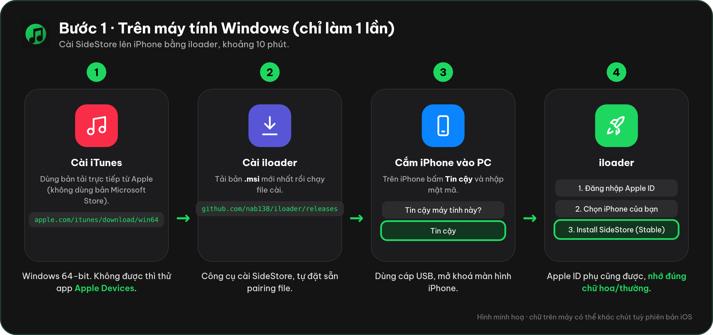
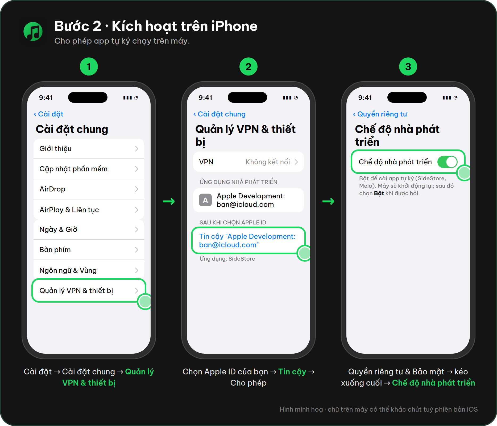
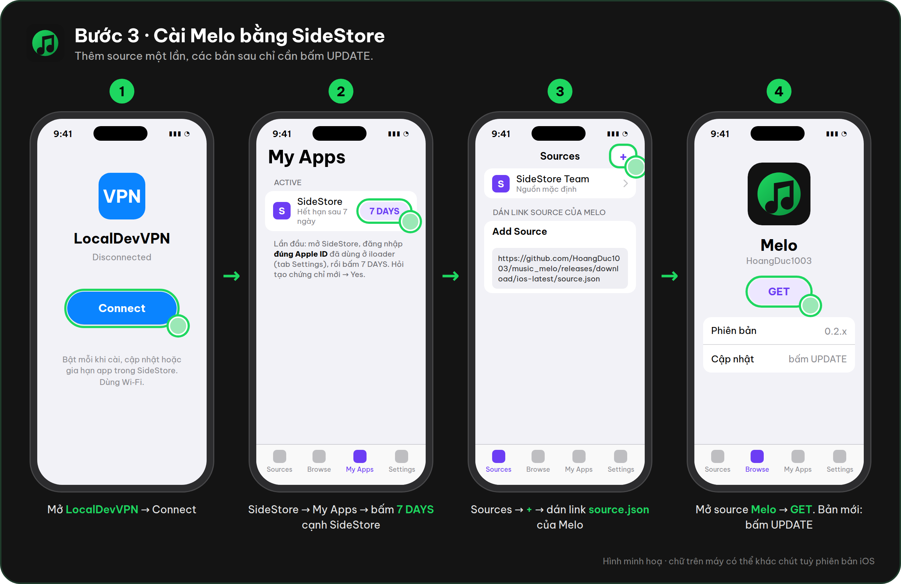
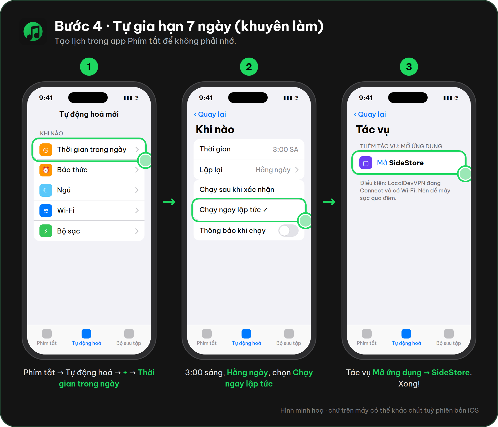
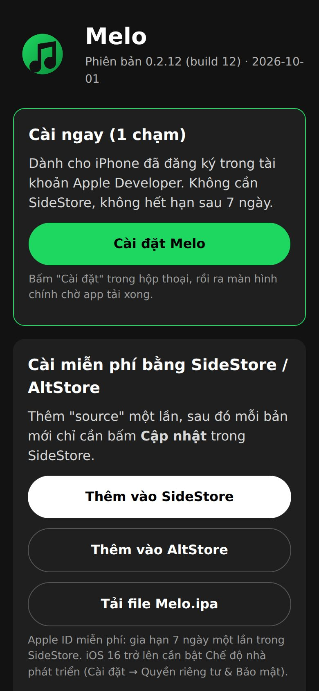

# Cài Melo lên iPhone

> Hình minh hoạ: các màn hình được vẽ lại với đúng tên mục cần bấm. Chữ trên máy có thể khác chút tuỳ phiên bản iOS.

Có hai cách:

| | Cách 1: SideStore (miễn phí) | Cách 2: Cài 1 chạm (Ad Hoc) |
|---|---|---|
| Chi phí | 0 đ | Tài khoản Apple Developer **99 USD/năm** |
| Cần app thứ ba | Có (SideStore + LocalDevVPN) | **Không**: mở trang web bằng Safari, bấm Cài đặt |
| Cần máy tính | Một lần, khoảng 15 phút (iloader) | Một lần, để lấy UDID và tạo chứng chỉ |
| Hết hạn | 7 ngày, SideStore tự gia hạn trên iPhone | 1 năm (theo hồ sơ Ad Hoc) |
| Cập nhật bản mới | Bấm Cập nhật trong SideStore | Mở lại trang cài đặt, bấm Cài đặt |
| Máy cài được | Máy có SideStore | Chỉ iPhone đã đăng ký mã máy (UDID), tối đa 100 máy/năm |

Apple không cho cài file IPA khi chưa được ký. Với Apple ID miễn phí, việc ký bắt buộc phải qua một công cụ như SideStore, AltStore hoặc Sideloadly. Muốn bỏ hẳn công cụ đó thì chỉ còn cách dùng tài khoản trả phí (cách 2).

**Còn bản web (Vercel, "Thêm vào MH chính") thì sao?**

Đã có, xem [WEB.md](WEB.md): không cần SideStore, nghe offline được. Nhưng bản web **không có YouTube Music**:

* Trình duyệt chặn web gọi thẳng YouTube (CORS). Muốn gọi phải có server trung gian, mà YouTube hay chặn IP máy chủ (Vercel, AWS…) bằng lỗi "Sign in to confirm you're not a bot".
* Vì vậy bản web lấy nhạc từ Jamendo (Creative Commons) và file nhạc của bạn. Phát khi khoá màn hình cũng kém ổn định hơn app thật.

Muốn nghe YouTube Music, phát nền chắc chắn và đồng bộ Spotify thì cài app iPhone theo một trong hai cách dưới đây.

---

## Cách 1: SideStore (miễn phí)

Chỉ cần máy tính **một lần** để cài SideStore. Sau đó cài Melo, cập nhật Melo và gia hạn 7 ngày đều làm ngay trên iPhone.

### 1. Trên iPhone

* Cài **LocalDevVPN** từ App Store, mở app và cho phép thêm cấu hình VPN.
* Dùng **Wi‑Fi**, không dùng 4G/5G.

LocalDevVPN cần bật mỗi khi SideStore cài, cập nhật hoặc gia hạn app.

### 2. Trên PC Windows (64-bit)

1. Cài **iTunes bản tải từ Apple**: https://www.apple.com/itunes/download/win64. Nếu iloader vẫn không nhận iPhone, thử app **Apple Devices** trên Microsoft Store.
2. Cài **iloader** (bản `.msi`) từ https://github.com/nab138/iloader/releases.
3. Cắm iPhone bằng cáp, bấm **Tin cậy** trên iPhone.
4. Mở iloader, đăng nhập Apple ID (có thể là Apple ID phụ), chọn iPhone, chọn **Install SideStore (Stable)**.

iloader tự đặt sẵn pairing file nên không phải làm tay.



### 3. Kích hoạt trên iPhone

1. **Cài đặt → Cài đặt chung → Quản lý VPN & Thiết bị**, chọn Apple ID ở mục Ứng dụng nhà phát triển, rồi bấm **Tin cậy**.
2. **Cài đặt → Quyền riêng tư & Bảo mật → Chế độ nhà phát triển**: bật, máy sẽ khởi động lại.
3. Mở LocalDevVPN, bấm **Connect**. Mở SideStore, đăng nhập **đúng Apple ID** đã dùng ở iloader.
4. Tab **My Apps**: bấm nút **7 DAYS** cạnh SideStore để gia hạn lần đầu. Nếu được hỏi tạo chứng chỉ mới, chọn **Yes**.



### 4. Cài Melo (một lần)

1. SideStore → **Sources** → **+** → dán:
   `https://github.com/HoangDuc1003/music_melo/releases/download/ios-latest/source.json`
   Hoặc mở trang cài đặt (khi đã bật GitHub Pages, xem Cách 2 bước 5) và bấm **Thêm vào SideStore**.
2. Trong source **Melo**, bấm **Get**.

Các bản sau chỉ cần bấm **Update** trong SideStore.



### 5. Tự gia hạn, không phải nhớ 7 ngày

SideStore tự gia hạn app khi chạy nền. Để chắc chắn hơn, tạo một tự động hoá trong app **Phím tắt**:

1. **Tự động hoá → + → Thời gian trong ngày**, ví dụ 3:00 sáng hằng ngày, lúc máy đang sạc và có Wi‑Fi.
2. Chọn **Chạy ngay lập tức**, tắt "Thông báo khi chạy".
3. Thêm tác vụ **Mở ứng dụng → SideStore**.

Điều kiện: LocalDevVPN đang kết nối và có Wi‑Fi. Nếu quá 7 ngày chưa gia hạn, Melo không mở được. Nhạc đã tải vẫn còn; chỉ cần mở SideStore gia hạn là dùng tiếp.



### Giới hạn của Apple ID miễn phí

* Tối đa **3 app tự cài** cùng lúc, tính cả SideStore.
* Tối đa 10 App ID mỗi 7 ngày.

### Cách khác

* Cài thẳng file: iloader có mục nhập IPA bất kỳ. Tải **Melo.ipa** ở [Releases](https://github.com/HoangDuc1003/music_melo/releases/tag/ios-latest) rồi cài từ PC. Cách này mỗi 7 ngày phải cắm máy tính lại, nên chỉ hợp để thử nhanh.
* **TrollStore** cài vĩnh viễn, nhưng chỉ chạy trên iOS 14.0 – 16.6.1, 16.7 RC và 17.0. Không chạy trên iOS 17.0.1 trở lên, kể cả iOS 18 và 26.

---

## Cách 2: Cài 1 chạm (Ad Hoc), không cần Mac

Làm một lần trên máy Windows (dùng **Git Bash**, có sẵn `openssl`), khoảng 20 phút. Sau đó mỗi lần cài hoặc cập nhật chỉ cần mở trang cài đặt bằng Safari:



### Bước 1: Tài khoản và thiết bị

1. Đăng ký **Apple Developer Program** (cá nhân) tại https://developer.apple.com/programs/enroll/.
2. Lấy **UDID** của iPhone. Trên Windows: cắm iPhone, mở **iTunes**, chọn iPhone, bấm vào dòng **Số sê-ri** cho tới khi hiện **UDID**, rồi chuột phải để copy.
3. Vào https://developer.apple.com/account/resources/devices → **+** → nhập tên và UDID.
4. Vào **Identifiers → +** → **App IDs → App**, đặt *Bundle ID* là **Explicit** `com.melo.music`. Không cần bật capability nào.

### Bước 2: Chứng chỉ Apple Distribution (trong Git Bash)

```bash
mkdir melo-signing && cd melo-signing
openssl req -new -newkey rsa:2048 -nodes -keyout melo.key -out melo.csr \
  -subj "/emailAddress=EMAIL_CUA_BAN/CN=Melo Distribution/C=VN"
```

1. Vào https://developer.apple.com/account/resources/certificates → **+** → **Apple Distribution** → tải lên `melo.csr` → tải về `distribution.cer` và đặt vào thư mục `melo-signing`.
2. Đổi sang file `.p12`, thay `MAT_KHAU_P12` bằng mật khẩu tự đặt:

```bash
openssl x509 -inform DER -in distribution.cer -out distribution.pem
openssl pkcs12 -export -inkey melo.key -in distribution.pem -out melo.p12 \
  -keypbe PBE-SHA1-3DES -certpbe PBE-SHA1-3DES -macalg sha1 -passout pass:MAT_KHAU_P12
```

> `melo.key` và `melo.p12` là **bí mật**. Không gửi cho ai, không đưa vào repo (repo đang public).

### Bước 3: Hồ sơ Ad Hoc

Vào https://developer.apple.com/account/resources/profiles → **+** → **Ad Hoc**, rồi chọn lần lượt:

1. App ID `com.melo.music`
2. chứng chỉ vừa tạo
3. iPhone của bạn

Đặt tên `Melo Ad Hoc` và tải về file `.mobileprovision`.

> Thêm iPhone mới thì phải tạo lại hồ sơ, rồi cập nhật secret ở bước 4.

### Bước 4: Đưa vào GitHub Secrets

Trong Git Bash, chép từng giá trị (dùng `cat file | clip` để copy trên Windows):

```bash
base64 -w0 melo.p12 > p12.txt
base64 -w0 "Melo_Ad_Hoc.mobileprovision" > profile.txt
```

Vào **GitHub → repo → Settings → Secrets and variables → Actions → New repository secret** và tạo 3 secret:

| Tên | Giá trị |
|---|---|
| `SIGNING_CERT_P12_BASE64` | nội dung `p12.txt` |
| `SIGNING_CERT_PASSWORD` | `MAT_KHAU_P12` |
| `ADHOC_PROFILE_BASE64` | nội dung `profile.txt` |

Sau đó xoá `p12.txt` và `profile.txt`.

### Bước 5: Bật trang cài đặt

**Settings → Pages → Build and deployment → Source: GitHub Actions.**

Khi bật, GitHub tạo môi trường `github-pages` và mặc định chỉ cho nhánh chính (`main`) đăng trang. Nếu đang build từ nhánh khác (ví dụ `claude/...`), làm một trong hai cách:

* gộp code vào `main`; hoặc
* vào **Settings → Environments → github-pages → Deployment branches and tags**, thêm nhánh đó (hoặc mẫu `claude/*`).

### Bước 6: Build và cài

1. Vào **Actions → iOS → Run workflow**, hoặc đẩy code mới lên.
2. Khi chạy xong, mở **https://hoangduc1003.github.io/music_melo/** bằng **Safari** trên iPhone.
3. Bấm **Cài đặt Melo** → **Cài đặt**.

App hiện trên màn hình chính, không cần SideStore và không hết hạn sau 7 ngày. Ad Hoc không cần bật Chế độ nhà phát triển.

**Cập nhật:** mỗi lần CI chạy xong, mở lại trang và bấm **Cài đặt Melo**. Nhạc đã tải vẫn còn vì mã app không đổi.

### Khi có lỗi

| Hiện tượng | Cách xử lý |
|---|---|
| "Không thể cài đặt Melo" | iPhone chưa có trong hồ sơ Ad Hoc → thêm UDID, tạo lại hồ sơ, cập nhật `ADHOC_PROFILE_BASE64`. |
| Job "Ký Ad Hoc" báo lỗi `.p12` | Sai mật khẩu, hoặc file `.p12` không chứa khoá → làm lại bước 2. |
| Trang `github.io` báo 404 | Chưa bật Pages (bước 5), hoặc lượt build chưa xong. |
| Job "Trang cài đặt" báo `Branch ... is not allowed to deploy` | Nhánh chưa được phép đăng trang → xem bước 5. |
| App mở ra rồi thoát ngay | Chứng chỉ hoặc hồ sơ hết hạn → tạo lại (1 năm một lần). |

Bước ký chạy trong CI bằng `scripts/adhoc-sign.sh`. Các bí mật chỉ nằm trong GitHub Secrets và một keychain tạm bị xoá ngay sau khi ký.
